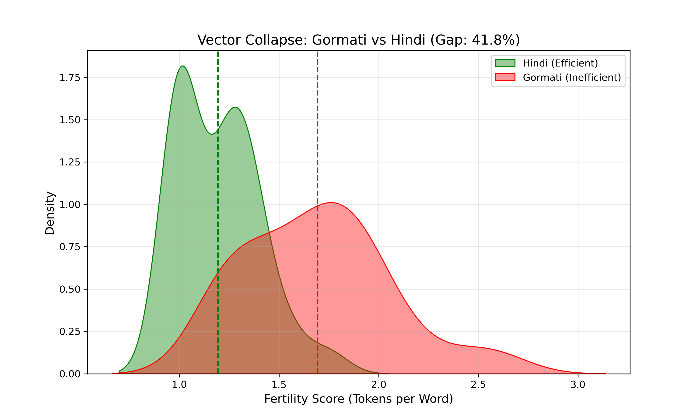

# Project Gora: NLP for the Gormati Language 📊

### Abstract
Gormati (also known as Banjari or Lambadi) is an Indo-Aryan language spoken by the Banjara community. Despite having millions of speakers, it is severely under-represented in modern Natural Language Processing (NLP). This project investigates the linguistic boundaries and computational penalties (the "Token Tax") imposed on Gormati when processed by standard multilingual models like Google MuRIL.

---

## 🧪 Experiment 1: The Vocabulary Gap
Before analyzing machine tokenization, we established a baseline for lexical divergence. Can Gormati simply use Hindi translation models? 

Using a pilot sample of distinct sentences, we measured the cross-lingual lexical gap.

**Conclusion:** Gormati has a highly unique contextual vocabulary. It cannot simply piggyback off Hindi datasets without significant data loss or misinterpretation.

---

## 🔍 Experiment 2: Qualitative Tokenization Failures
To understand *why* tokenizers fail, we analyzed specific grammatical structures. Standard models consistently struggle with fundamental Gormati linguistic patterns, leading to severe word fragmentation (indicated in red).

* **The Suffix Problem:** Fails to parse agglutinative suffixes.
  
* **Action Verbs:** Continuous action indicators (*riyo*, *cho*) confuse the model.
  
* **Core Vocabulary:** Fails to recognize basic Gormati-specific familial/descriptive words.
  

---

### 📐 Experiment 3: Mini-Quantitative Test
Our initial audit of 5 sentences confirmed a **14.8% inefficiency gap** compared to Hindi.

### 🕹️ Experiment 4: Gormati Live Lab
Want to test the token tax yourself? We built an interactive CLI tool to let you input custom Gormati sentences and their Hindi translations to measure real-time vector collapse.

Run the lab locally:
`python 04_gormati_live_lab.py`

**The lab will output:**
* The raw fragmented tokens for both languages.
* A real-time Inefficiency Score multiplier.
* An evaluation flag (e.g., `✅ GREAT SENTENCE! (High Tokenization Failure)` if the ratio exceeds 1.3x).

---

## 🥗 Experiment 5: Multi-Domain "Mixed Salad" Audit
To ensure our findings weren't limited to specific topics, we conducted a 32-sentence audit across four distinct linguistic domains:
1. **Nature & Time** (Environmental context)
2. **Social Honorifics** (Casual vs. Respectful verb conjugations)
3. **Family & Grammar** (Agglutinative suffixes)
4. **Numerical Systems** (Counting logic)

**Final Result:** - **Hindi Avg Score:** 1.22
- **Gormati Avg Score:** 1.59
- **Systemic Inefficiency:** Gormati remains significantly more fragmented across all linguistic domains.
- 
**Result:** The "Token Tax" is systemic. Regardless of the domain, Gormati consistently exhibits a broader, more "fertile" (inefficient) distribution than Hindi, confirming that the tokenizer lack of Gormati-specific embeddings is a universal barrier for the language.

---

## 🏁 Experiment 6: Quantitative Audit (In Progress — Gormati-1K)

Our initial audit of the full `Gora_Dataset` (32 sentences) produced a preliminary finding:

- **Hindi Efficiency Score:** 1.194 (Baseline)
- **Gormati Efficiency Score:** 1.693 (High Cost)
- **Total Inefficiency Gap:** **41.83%** *(pilot estimate, sentence-level token ratio)*

**Methodological refinement:** sentence-level token ratios conflate two distinct effects — (1) tokenizer fragmentation, where MuRIL splits Gormati-specific vocabulary into excess subwords due to missing coverage, and (2) cross-linguistic verbosity, where Hindi and Gormati simply use different word counts to express the same meaning, independent of tokenizer quality. Only the first effect represents a genuine "token tax."

We are currently isolating the fragmentation-specific signal (subwords-per-word delta, controlled for verbosity) on a 1,000 sentence-pair parallel corpus — **Gormati-1K** — now under construction. Early batches on this corrected metric show a smaller but still consistent fragmentation penalty; full results pending.

### Conclusion

Project Gora's pilot work indicates Gormati is under-served by standard multilingual tokenizers like MuRIL, with an initial estimate suggesting up to ~42% overhead using a naive sentence-level metric. Ongoing work on the Gormati-1K corpus is refining this into a fragmentation-specific measure that isolates genuine tokenizer inequity from cross-linguistic word-count differences — the goal being a rigorous, defensible case for dedicated Gormati tokenizer support and vocabulary expansion.

**Status: active, validation in progress.**

