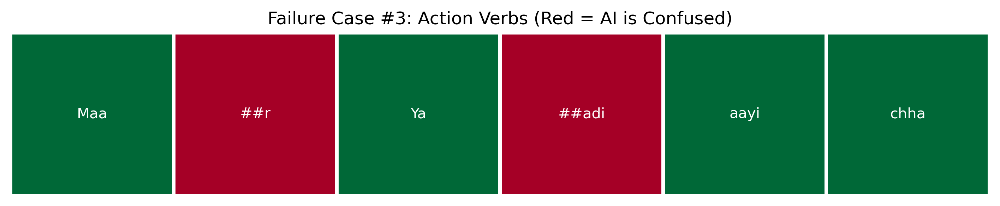
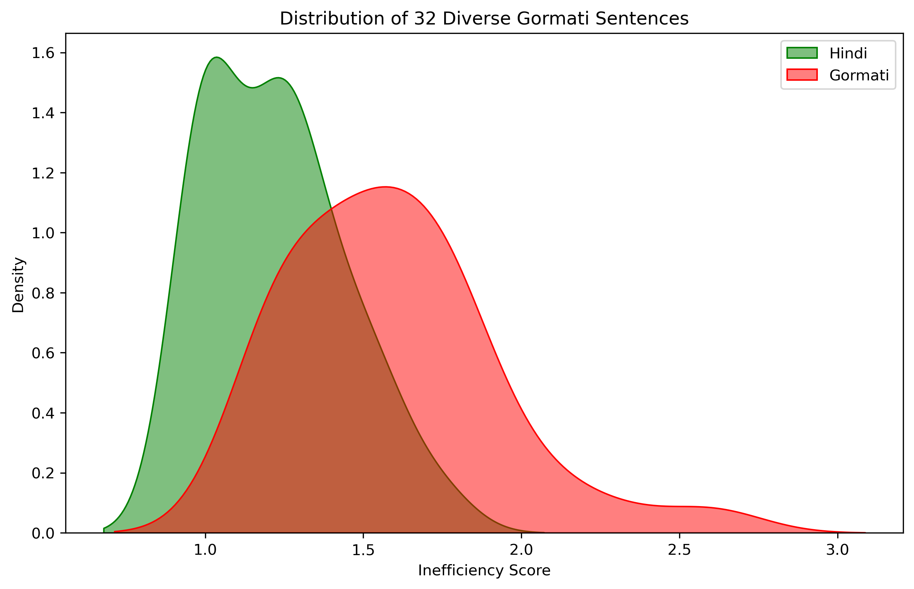

# Project Gora: NLP for the Gormati Language 📊

### Abstract
Gormati (also known as Banjari or Lambadi) is an Indo-Aryan language spoken by the Banjara community. Despite having millions of speakers, it is severely under-represented in modern Natural Language Processing (NLP). This project investigates the linguistic boundaries and computational penalties (the "Token Tax") imposed on Gormati when processed by standard multilingual models like Google MuRIL.

---

## 🧪 Experiment 1: The Vocabulary Gap
Before analyzing machine tokenization, we established a baseline for lexical divergence. Can Gormati simply use Hindi translation models? 

Using a pilot sample of distinct sentences, we measured the cross-lingual lexical gap.

**Conclusion:** Gormati has a highly unique contextual vocabulary. It cannot simply piggyback off Hindi datasets without significant data loss or misinterpretation.

---

## 🔍 Experiment 2: Qualitative Tokenization Failures
To understand *why* tokenizers fail, we analyzed specific grammatical structures. Standard models consistently struggle with fundamental Gormati linguistic patterns, leading to severe word fragmentation (indicated in red).

* **The Suffix Problem:** Fails to parse agglutinative suffixes.
  
* **Action Verbs:** Continuous action indicators (*riyo*, *cho*) confuse the model.
  
* **Core Vocabulary:** Fails to recognize basic Gormati-specific familial/descriptive words.
  

---

### 📐 Experiment 3: Mini-Quantitative Test
Our initial audit of 5 sentences confirmed a **14.8% inefficiency gap** compared to Hindi.

### 🕹️ Experiment 4: Gormati Live Lab
Want to test the token tax yourself? We built an interactive CLI tool to let you input custom Gormati sentences and their Hindi translations to measure real-time vector collapse.

Run the lab locally:
`python 04_gormati_live_lab.py`

**The lab will output:**
* The raw fragmented tokens for both languages.
* A real-time Inefficiency Score multiplier.
* An evaluation flag (e.g., `✅ GREAT SENTENCE! (High Tokenization Failure)` if the ratio exceeds 1.3x).

---

## 🥗 Experiment 5: Multi-Domain "Mixed Salad" Audit
To ensure our findings weren't limited to specific topics, we conducted a 32-sentence audit across four distinct linguistic domains:
1. **Nature & Time** (Environmental context)
2. **Social Honorifics** (Casual vs. Respectful verb conjugations)
3. **Family & Grammar** (Agglutinative suffixes)
4. **Numerical Systems** (Counting logic)

**Final Result:** - **Hindi Avg Score:** 1.22
- **Gormati Avg Score:** 1.59
- **Systemic Inefficiency:** Gormati remains significantly more fragmented across all linguistic domains.
- 
**Result:** The "Token Tax" is systemic. Regardless of the domain, Gormati consistently exhibits a broader, more "fertile" (inefficient) distribution than Hindi, confirming that the tokenizer lack of Gormati-specific embeddings is a universal barrier for the language.

---

## 🏁 Experiment 6: Final Quantitative Audit (Full Dataset)
Our research concluded with a comprehensive audit of the entire `Gora_Dataset`. By processing the full corpus through the Google MuRIL tokenizer, we confirmed a systemic computational inequality.

**Final Global Metrics:**
* **Hindi Efficiency Score:** 1.194 (Baseline)
* **Gormati Efficiency Score:** 1.693 (High Cost)
* **Total Inefficiency Gap:** **41.83%**

### Conclusion
Project Gora proves that Gormati is currently "taxed" by nearly 42% in standard multilingual environments. This fragmentation (Vector Collapse) highlights a critical need for dedicated Gormati tokenizers and vocabulary expansion to ensure equitable access to AI technology.
