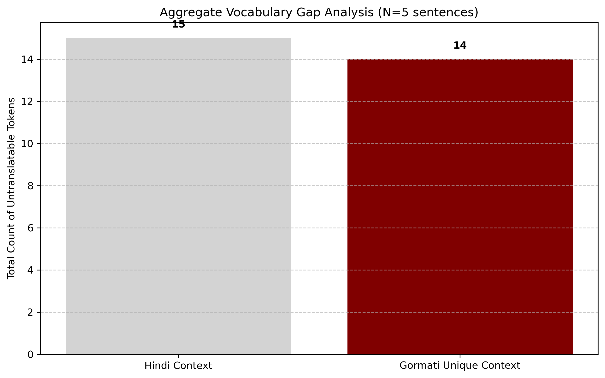
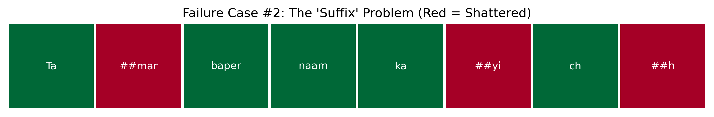
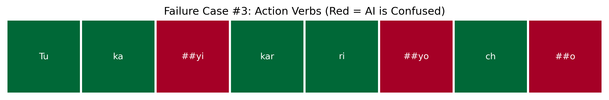
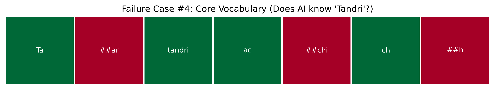

# Project Gora: NLP for the Gormati Language 📊

### Abstract
Gormati (also known as Banjari or Lambadi) is an Indo-Aryan language spoken by the Banjara community. Despite having millions of speakers, it is severely under-represented in modern Natural Language Processing (NLP). This project investigates the linguistic boundaries and computational penalties (the "Token Tax") imposed on Gormati when processed by standard multilingual models like Google MuRIL.

---

## 🧪 Experiment 1: The Vocabulary Gap
Before analyzing machine tokenization, we established a baseline for lexical divergence. Can Gormati simply use Hindi translation models? 

Using a pilot sample of distinct sentences, we measured the cross-lingual lexical gap.

**Conclusion:** Gormati has a highly unique contextual vocabulary. It cannot simply piggyback off Hindi datasets without significant data loss or misinterpretation.

---

## 🔍 Experiment 2: Qualitative Tokenization Failures
To understand *why* tokenizers fail, we analyzed specific grammatical structures. Standard models consistently struggle with fundamental Gormati linguistic patterns, leading to severe word fragmentation (indicated in red).

* **The Suffix Problem:** Fails to parse agglutinative suffixes.
  
* **Action Verbs:** Continuous action indicators (*riyo*, *cho*) confuse the model.
  
* **Core Vocabulary:** Fails to recognize basic Gormati-specific familial/descriptive words.
  

---

## 📐 Experiment 3: Mini-Audit & Gormati Live Lab
We built a quantitative pilot test and an interactive CLI tool to measure real-time vector collapse. 
## 🕹️ Interactive: Gormati Live Lab
Want to test the token tax yourself? We built an interactive CLI tool to let you input custom Gormati sentences and their Hindi translations to measure real-time vector collapse.

Run the lab locally:
`python 04_gormati_live_lab.py`

**The lab will output:**
* The raw fragmented tokens for both languages.
* A real-time Inefficiency Score multiplier.
* An evaluation flag (e.g., `✅ GREAT SENTENCE! (High Tokenization Failure)` if the ratio exceeds 1.3x).
In our initial mini-audit, we found the model was **14.8% less efficient** on Gormati than Hindi.
